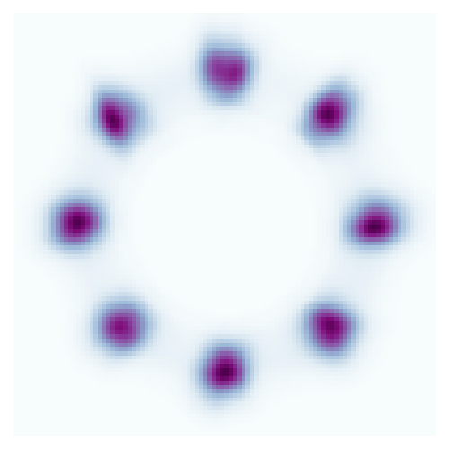
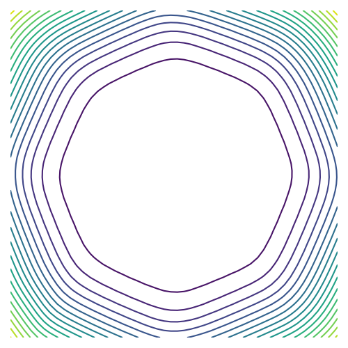
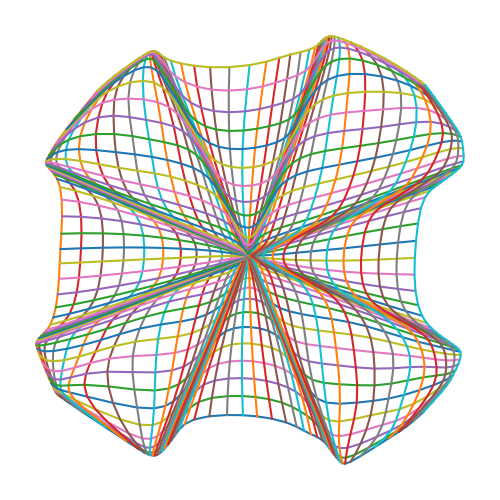
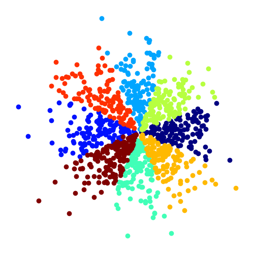
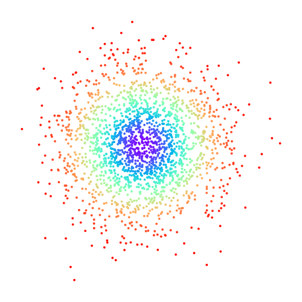
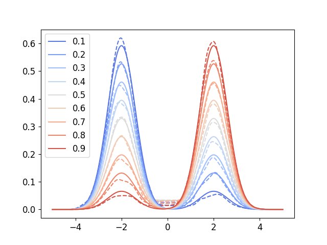
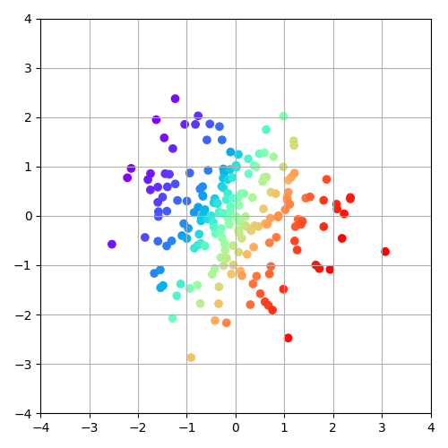
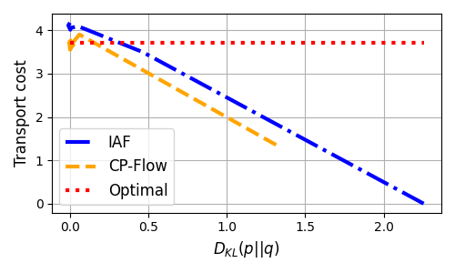

# Convex Potential Flows

This is the official repository for the paper 

> "Convex Potential Flows: Universal Probability Distributions with Optimal Transport and Convex Optimization"
by Chin-Wei Huang, Ricky TQ Chen, Christos Tsirigotis, Aaron Courville. In ICLR 2021. 
[[arXiv](https://arxiv.org/abs/2012.05942)] [[OpenReview](https://openreview.net/forum?id=te7PVH1sPxJ)]


## Dependencies:  

run `pip install -r requirements.txt`


## Datasets

* For the Cifar 10 / MNIST image modeling experiments: the datasets will be downloaded automatically 
using the torchvision package
* For the tabular density estimation experiments: download the datasets from 
https://github.com/gpapamak/maf
* For the VAE experiments, please download the datasets following the instruction in the respective folders of 
https://github.com/riannevdberg/sylvester-flows/tree/master/data


## Experiments


•• **Important** ••
Unless otherwise specified, the loss (negative log likelihood) printed during training 
is not a measure of the log likelihood; instead it's a "surrogate" loss function explained in the paper:
differentiating this surrogate loss will give us an stochastic estimate of the gradient. 

To clarify:
When the model is in the .train() mode, the `forward_transform_stochastic` function is used to give a stochastic estimate of 
the logdet "gradient".
When in .eval() mode, a stochastic estimate of the logdet itself (using Lanczos) will be provided.
The `forward_transform_bruteforce` function computes the logdet exactly.

As an example, we've used the following context wrapper in `train_tabular.py` to obtain a likelihood estimate
throughout training:

```python
def eval_ctx(flow, bruteforce=False, debug=False, no_grad=True):
    flow.eval()
    for f in flow.flows[1::2]:
        f.no_bruteforce = not bruteforce
    torch.autograd.set_detect_anomaly(debug)
    with torch.set_grad_enabled(mode=not no_grad):
        yield
    torch.autograd.set_detect_anomaly(False)
    for f in flow.flows[1::2]:
        f.no_bruteforce = True
    flow.train()
```

Turning flow.no_bruteforce to `False` will force the flow to calculate logdet exactly in .eval() mode.


#### Toy 2D experiments
 
To reproduce the toy experiments, run the following example cmd line
```
python train_toy.py --dataset=EightGaussian --nblocks=1 --depth=20 --dimh=32
```

Here's the learned density




When only one flow layer (`--nblocks=1`) is used, it will also produce a few interesting plots 
for one to analyze the flow, such as the

(Convex) potential function



and the corresponding gradient distortion map




For the 8 gaussian experiment, we've color-coded the samples to visualize the encodings:




#### Toy image point cloud

We can also set `--img_file` to learn the "density" of a 2D image as follows:

```
python train_toy.py --img_file=imgs/github.png --dimh=64 --depth=10
```




#### Toy conditional 2D experiments

We've also have a toy conditional experiment to assess the representational power of 
the partial input convex neural network (PICNN). The dataset is a 1D mixture of Gaussian 
whose weighting coefficient is to be conditioned on (the values in the legend in the following figure). 

```
python train_toy_cond.py 
```

Running the above code will generate the following conditional density curves




#### OT map learning

To learn the optimal transport map (between Gaussians), run
```
python train_ot.py 
```

(Modify `dimx = 2` in the code for higher dimensional experiments)

CP-Flow will learn to transform the input Gaussian


into a prior standard Gaussian "monotonically"




This means the transport map is the most efficient one in the OT sense 
(in contrast, IAF also learns a transport map with 0 KL, but it has a higher transport cost):




#### Larger scale experiments

For larger scale experiments reported in the paper, run the following training scripts:

* `train_img.py` for the image modeling experiments
* `train_tabular.py` for the tabular data density estimation
* `train_vae.py` for improving variational inference (VAE) using flows
